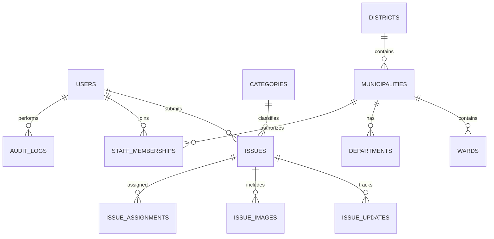

# CivicTrack ER model (logical)

```mermaid
erDiagram
 USERS ||--o{ ISSUES : submits
 CATEGORIES ||--o{ ISSUES : classifies
 DISTRICTS ||--o{ MUNICIPALITIES : contains
 MUNICIPALITIES ||--o{ WARDS : contains
 MUNICIPALITIES ||--o{ DEPARTMENTS : has
 USERS ||--o{ STAFF_MEMBERSHIPS : joins
 MUNICIPALITIES ||--o{ STAFF_MEMBERSHIPS : authorizes
 ISSUES ||--o{ ISSUE_UPDATES : tracks
 ISSUES ||--o{ ISSUE_IMAGES : includes
 ISSUES ||--o{ ISSUE_ASSIGNMENTS : assigned
 USERS ||--o{ AUDIT_LOGS : performs
```
